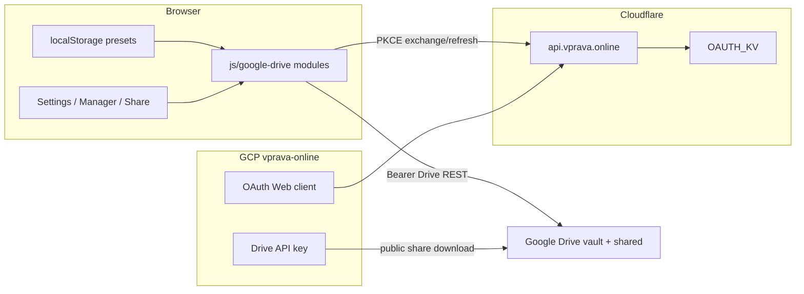

# Google sync, backup, and share for trainings (vprava.online)

## Goal

Deliver the **same user-facing capabilities** as [diagrams.free](https://diagrams.free) / Excalidraw for this app’s trainings (presets):

| Feature | Behavior |
|---------|----------|
| Sign in with Google | OAuth `drive.file` + openid/email/profile |
| Sync / backup | Bidirectional merge of all local trainings with Drive vault |
| Auto-backup | Debounced push after local save when enabled |
| Share | Snapshot upload + `https://vprava.online/#share={fileId}` |

Trainings stay device-local in `localStorage` (`interval_timer_v1`); Drive is the cross-device backup, not a server of record.

## Current state

- App: vanilla HTML/JS PWA, no build step — almost all logic in [`index.html`](index.html)
- Persistence: presets with `id`, `name`, `segments`, `cycles`, `audio`, `updatedAt`, etc. via `loadStore()` / `saveStore()`
- Hosting: GitHub Pages + **`vprava.online`** ([`CNAME`](CNAME)); legacy host `timer.konashevych.com` may still resolve
- Drive client modules and Settings UI already exist under `js/google-drive/`; feature stays gated until `GOOGLE_CLIENT_ID` is set
- **GCP:** new project **`vprava-online`** (display name **vprava**, project number `745192830125`) — **not** Chromium / AlienPass

Reference implementation: Excalidraw `excalidraw-app/google-drive/` + Worker pattern from `workers/diagrams-free-oauth/`.

## Architecture (chosen)

```text
Browser (https://vprava.online)
  │ PKCE popup → Google
  │ access_token in localStorage (+ optional IDB)
  │ HttpOnly cookie → api.vprava.online
  ├─ POST /oauth/exchange|refresh|revoke ──► Cloudflare Worker
  │                                         (client_secret + refresh tokens in KV)
  └─ Drive API v3 ─────────────────────────► vprava.online/
                                               vault/manifest.json
                                               vault/trainings/{id}.json
                                               shared/share-*.json
```

**Why a Worker:** static GitHub Pages cannot hold the OAuth client secret or refresh tokens safely.

**Defaults locked in:**

- Full feature set (sync + auto-backup + share)
- Keep **no bundler**: plain ES modules under `js/google-drive/`
- **GCP project:** **`vprava-online`** (name: vprava) — dedicated to this app; do **not** use Chromium or diagrams-free
- Cookie domain: **`.vprava.online`**; API host: **`api.vprava.online`**
- Drive root folder name: **`vprava.online`** (new vaults; migrate/read legacy `timer.konashevych.com` folder if users already backed up there)
- Conflict rule: **last-write-wins per training by `updatedAt`**; deletes via manifest tombstones
- Share: anyone-with-link reader snapshot only



## GCP project vprava-online

| Field | Value |
|-------|--------|
| Display name | `vprava` |
| Project ID | `vprava-online` |
| Project number | `745192830125` |
| Console | https://console.cloud.google.com/home/dashboard?project=vprava-online |

### Console work (sync settings live here)

1. Ensure **Google Drive API** is enabled.
2. **OAuth consent screen** (External): app name `VPRAVA.ONLINE` / `vprava`; support email; privacy `https://vprava.online/privacy/`; terms `https://vprava.online/terms/`; scopes `drive.file`, `openid`, `email`, `profile`.
3. **Credentials → OAuth client ID** → Web application:
   - Name: `VPRAVA.ONLINE`
   - Authorized JavaScript origins: `https://vprava.online`, `https://www.vprava.online` (+ localhost for dev)
   - Authorized redirect URI: `https://vprava.online/oauth-callback.html`
4. Copy **Client ID** into [`js/google-drive/config.js`](js/google-drive/config.js) and Worker `[vars].GOOGLE_CLIENT_ID`.
5. Put **Client secret** only on the Worker (`wrangler secret put GOOGLE_CLIENT_SECRET`) — never commit.
6. **API key** restricted to Drive API (+ HTTP referrers for `vprava.online`) → `GOOGLE_API_KEY` in config for anonymous `#share=` opens.

## OAuth Worker + DNS

- Worker: [`workers/timer-oauth/`](workers/timer-oauth/) (rename/retarget as needed)
- `ALLOWED_ORIGINS`: `https://vprava.online`, `https://www.vprava.online`, localhost
- Route: `api.vprava.online/*` on zone `vprava.online`
- Cookie: `Domain=.vprava.online` (replace `.konashevych.com`)
- DNS: proxied CNAME `api` → zone apex (Free Universal SSL covers `*.vprava.online`)

## Implementation status

| Area | Status |
|------|--------|
| Drive ES modules + Settings / Manager / `#share=` UI | Done |
| Tombstones, orphan GC, silent auto-merge, reconnect | Done |
| GCP project `vprava-online` created | Done |
| Drive API enabled on `vprava-online` | In progress |
| OAuth Web client + API key in `vprava-online` | Todo |
| Retarget Worker/DNS/cookie/config from konashevych → vprava.online | Todo |
| Docs / privacy / terms / README aligned to vprava.online + vprava-online | Todo |

## Rollout remaining

1. Finish GCP credentials in **vprava-online** (client ID, secret, API key, consent).
2. Point OAuth proxy at `api.vprava.online` (DNS + Worker route + cookie domain + `ALLOWED_ORIGINS`).
3. Set `GOOGLE_CLIENT_ID` / `GOOGLE_API_KEY` / `OAUTH_PROXY_URL` / Drive folder defaults in config.
4. Redeploy Worker with real secret; verify `/health` and sign-in on production.
5. Refresh privacy/terms/docs to name GCP project `vprava-online` and host `vprava.online`.

## Out of scope

- Live collaborative editing
- Email-restricted Drive sharing (`drive.file` limitation)
- Introducing Vite/npm for the main app
- Syncing non-training prefs (locale, PWA install prefs)

## Risk notes

- **Google OAuth verification:** `drive.file` is typically non-sensitive; consent branding must match VPRAVA.ONLINE.
- **Billing:** link a billing account to `vprava-online` if Google requires it for API quotas.
- **Legacy vaults:** users who already synced under folder `timer.konashevych.com` need a read-fallback or one-time migration to `vprava.online/`.
- **PWA token refresh:** Worker cookie must be `Secure`, `HttpOnly`, `SameSite=None` for `api.vprava.online` ↔ `vprava.online`.
