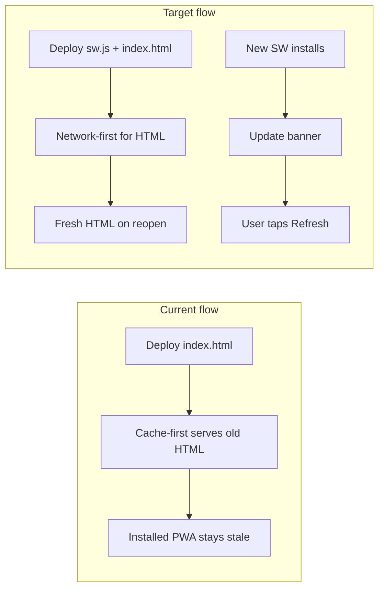

# PWA Updates and UX Fixes

## Problem summary

Installed PWAs may not receive HTML updates because [`sw.js`](sw.js) uses **cache-first** for all same-origin assets. There is no update prompt when a new service worker activates. Two minor UX issues remain in [`index.html`](index.html): completed trainings require Reset before Play, and the About feedback link text is unclear.



---

## 1. PWA update best practices

### 1a. Network-first caching for app shell — [`sw.js`](sw.js)

Change the same-origin fetch handler (lines 70–82) to branch on navigation/HTML requests:

- **`/` and `/index.html`**: network-first, cache fallback (offline still works)
- **Static assets** (icons, screenshots, manifest): keep cache-first (rarely change)
- **CDN assets**: no change (existing cache-first + network fill)

Add a deploy comment at the top of `sw.js`:

```js
// Deploy: bump CACHE_NAME here AND APP_VERSION in index.html
```

### 1b. Update detection and refresh prompt — [`index.html`](index.html)

Extend `registerServiceWorker()` (~line 2526):

1. Store `registration` reference after `register('/sw.js')`
2. On load: call `registration.update()`
3. On `document.visibilitychange` → `visible`: call `registration.update()` again
4. When `registration.installing` reaches `waiting`, show update UI
5. Listen for `navigator.serviceWorker` `controllerchange` → show same UI (pairs with existing `skipWaiting()` in sw.js)
6. **Refresh** button calls `location.reload()`
7. Guard against reload loops with a session flag if needed

**UI**: small fixed banner above the tab bar (non-blocking toast-style), matching existing dark/emerald design. New i18n keys:

- EN: `updateAvailable: 'Update available'`, `updateRefresh: 'Refresh'`
- UK: `updateAvailable: 'Доступне оновлення'`, `updateRefresh: 'Оновити'`

Existing `skipWaiting()` + `clients.claim()` in sw.js stay — only add the missing user-facing reload step.

---

## 2. Play restarts completed training — [`index.html`](index.html)

**Root cause**: `startTimer()` (~line 2124) only initializes state when `currentPhase === 'idle'`. After `finishWorkout()` sets `phase = 'completed'`, Play sets `isRunning = true` on stale state (`currentSecond = 0`).

**Fix** in `startTimer()`:

```js
if (timerState.currentPhase === 'idle' || timerState.currentPhase === 'completed') {
  timerState.cycleIndex = 1;
  const first = getFirstActiveSegment();
  // set segmentIndex, currentSecond, currentPhase = 'active'
  // play opening work beep if applicable
}
```

Reuse `buildInitialRuntime(activePreset)` where possible to avoid duplicating first-segment logic. Reset button behavior unchanged.

---

## 3. About feedback link text — [`index.html`](index.html)

In About view (~line 522), change link text from `@oleksiiko` to `telegram: @oleksiiko`.

Add i18n key `feedbackTelegram` (EN + UK; handle can stay the same in both locales). Settings menu Feedback row (line 481) keeps generic "Feedback" label — only the About detail link changes.

---

## 4. Version bump (last step)

| Constant | File | From | To |
|----------|------|------|----|
| `CACHE_NAME` | [`sw.js`](sw.js) | `interval-timer-v8` | `interval-timer-v9` |
| `APP_VERSION` | [`index.html`](index.html) | `1.0.0` | `1.1.0` |

About screen (`#aboutVersionValue`) already reads `APP_VERSION` — no extra wiring needed.

---

## Implementation order

1. `sw.js` — network-first HTML + bump `CACHE_NAME` to v9
2. `index.html` — update banner, `registration.update()` on load/visibility
3. `index.html` — `startTimer()` restart-from-completed
4. `index.html` — About feedback link + i18n
5. `index.html` — bump `APP_VERSION` to `1.1.0`
6. Manual test, commit, push

---

## Test matrix

| Scenario | Expected |
|----------|----------|
| Fresh install, first visit | App works; offline after precache |
| Deploy while app open | Update banner appears; Refresh loads new version |
| Deploy, reopen app | New version without manual cache clear |
| Training completes → Play | Restarts cycle 1, first segment, no Reset needed |
| Training completes → Reset → Play | Still works |
| About → Feedback link | Shows `telegram: @oleksiiko`, opens t.me |
| About → Version | Shows `1.1.0` |

---

## Files touched

- [`sw.js`](sw.js) — caching strategy, cache version bump
- [`index.html`](index.html) — SW update UI, timer restart, feedback text, app version

No new dependencies or build tooling.
